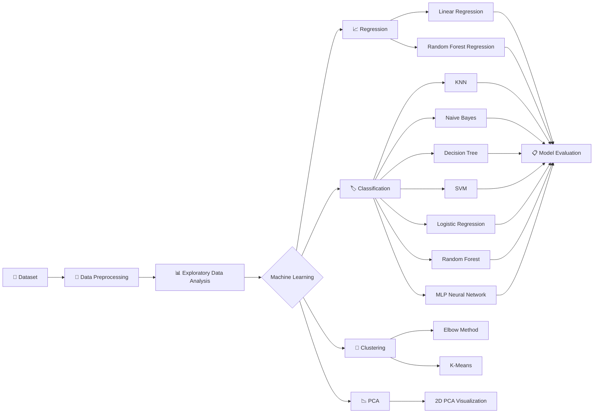
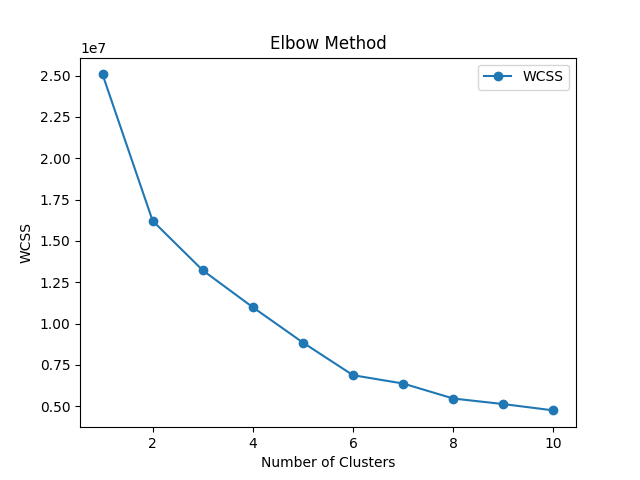
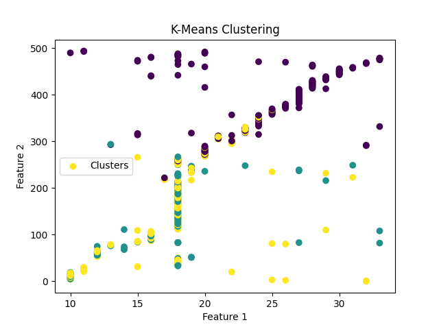
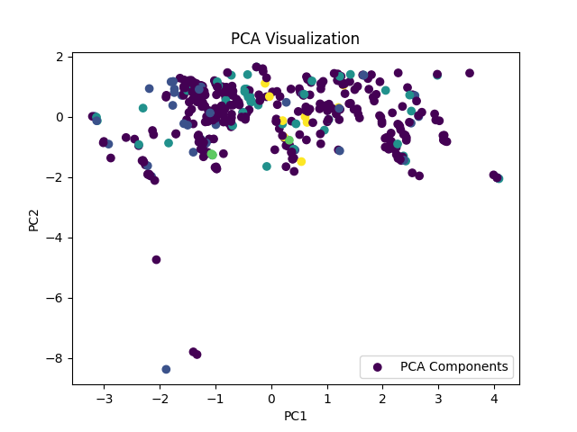
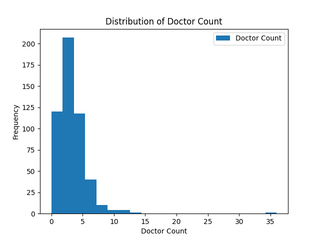
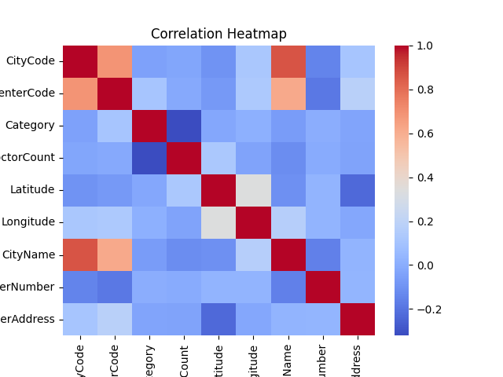
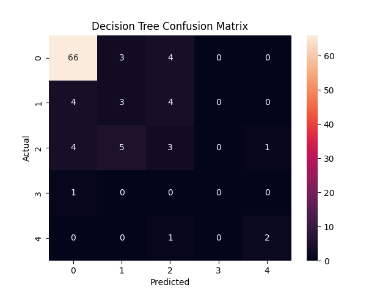
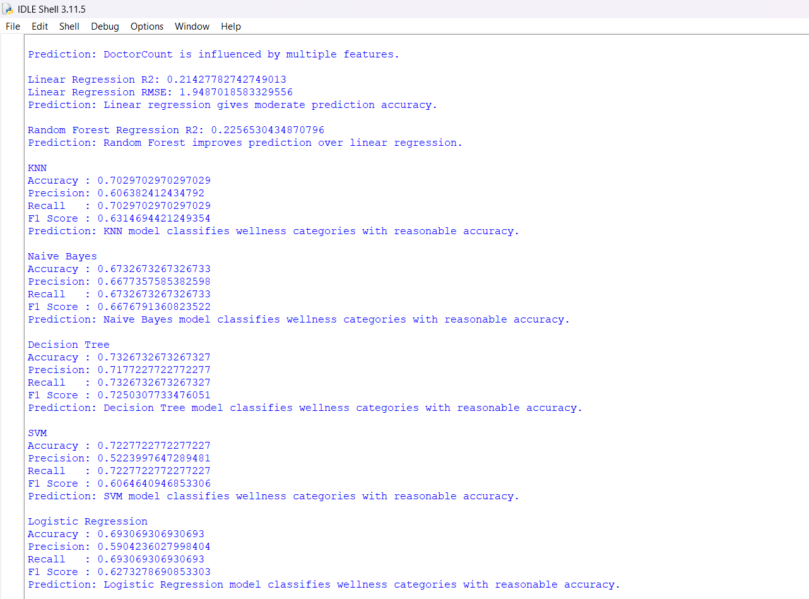
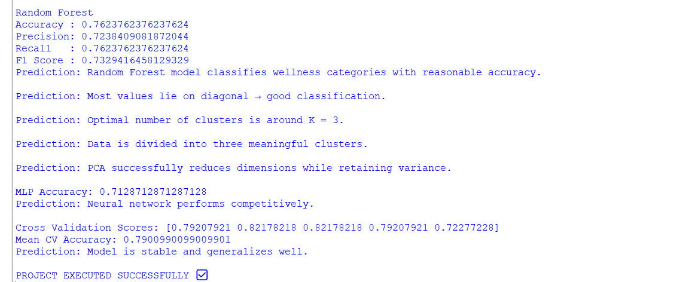

<div align="center">

# 🏥 Wellness Center Predictive Analytics

### Machine Learning • Predictive Analytics • Classification • Clustering • PCA


<br>


<br><br>


</div>

---

## 🚀 Project Overview

**Wellness Center Predictive Analytics** is an end-to-end machine learning project designed to analyze wellness center data and apply multiple predictive and unsupervised learning techniques.

The project covers the complete machine learning workflow:

> **Data Preprocessing → Exploratory Analysis → Feature Engineering → Model Training → Evaluation → Clustering → PCA → Cross-Validation**

The primary analytical tasks are:

- 📈 **Doctor Count Prediction**
- 🏷️ **Wellness Center Category Classification**
- 🔵 **K-Means Clustering**
- 📉 **Principal Component Analysis**
- 🧠 **Neural Network Classification**
- 🔄 **Cross-Validation**

---

## 🎯 Project Objectives

- Analyze wellness center characteristics and doctor distribution.
- Identify relationships between available features.
- Predict the number of doctors using regression algorithms.
- Classify wellness centers into different categories.
- Compare multiple machine learning classification algorithms.
- Discover data patterns using K-Means clustering.
- Reduce dimensionality using PCA.
- Evaluate model performance using appropriate statistical metrics.

---

## 🧩 Machine Learning Pipeline



---

## 🛠️ Tech Stack

| Category | Technologies |
|---|---|
| Programming | Python |
| Data Processing | Pandas, NumPy |
| Visualization | Matplotlib, Seaborn |
| Machine Learning | Scikit-learn |
| Scientific Computing | SciPy |
| Regression | Linear Regression, Random Forest |
| Classification | KNN, Naive Bayes, Decision Tree, SVM, Logistic Regression, Random Forest |
| Neural Network | MLPClassifier |
| Clustering | K-Means |
| Dimensionality Reduction | PCA |
| Model Validation | K-Fold Cross-Validation |

---

## 📊 Dataset & Preprocessing

The dataset contains wellness center information including location-related attributes, categories, doctor counts, and other center-level features.

### Preprocessing performed

```text
✔ Missing value handling
✔ Infinite value handling
✔ Numeric type conversion
✔ Mean imputation
✔ Mode imputation
✔ Categorical encoding
✔ Feature scaling
✔ Train-test splitting
```

Dataset location:

```text
data/
└── wellness_center_data.csv
```

---

# 📈 Regression Analysis

The regression task focuses on predicting:

```text
Target → DoctorCount
```

### Models

- Linear Regression
- Random Forest Regression

### Evaluation

| Model | R² Score | RMSE |
|---|---:|---:|
| Linear Regression | 0.2143 | 1.9482 |
| Random Forest Regression | 0.2257 | — |

The Random Forest Regression model achieved an R² score of approximately **0.226** on the test dataset.

---

# 🏷️ Classification Analysis

The classification task predicts:

```text
Target → Wellness Center Category
```

### Model Comparison

| Model | Accuracy | Precision | Recall | F1 Score |
|---|---:|---:|---:|---:|
| KNN | 70.30% | 60.64% | 70.30% | 63.15% |
| Naive Bayes | 67.33% | 66.77% | 67.33% | 66.77% |
| Decision Tree | 73.27% | 71.77% | 73.27% | 72.51% |
| SVM | 72.27% | 52.24% | 72.27% | 60.65% |
| Logistic Regression | 69.31% | 59.04% | 69.31% | 62.73% |
| Random Forest | **76.24%** | 72.38% | 76.24% | **73.29%** |

---

## 🔄 Cross-Validation

A 5-fold cross-validation procedure was performed using Random Forest Classification.

```text
Cross-Validation Scores:

0.7921
0.8218
0.8218
0.7921
0.7228
```

### Mean Cross-Validation Accuracy

```text
79.01%
```

This provides an additional view of model performance across multiple validation folds.

---

# 🔵 Unsupervised Learning

## K-Means Clustering

K-Means clustering was applied to identify groups within the wellness center dataset.

The project used:

```text
Number of Clusters = 3
```

### Elbow Method



### K-Means Visualization



---

# 📉 Principal Component Analysis

PCA was applied to transform the feature space into two principal components for visualization.



---

# 📊 Data Visualizations

## Doctor Count Distribution



The distribution shows that most observations contain relatively lower doctor counts, with fewer observations at higher values.

---

## Correlation Heatmap



The heatmap provides an overview of relationships among the encoded dataset features.

---

## Decision Tree Confusion Matrix



The confusion matrix shows the actual versus predicted class distribution for the Decision Tree classifier.

---

# 🖥️ Model Evaluation

### Classification Results



### Additional Results



---

# 📁 Project Structure

```text
Wellness-Center-Predictive-Analytics/
│
├── 📂 data/
│   └── wellness_center_data.csv
│
├── 📂 images/
│   ├── doctor_count_distribution.png
│   ├── correlation_heatmap.png
│   ├── confusion_matrix.png
│   ├── elbow_method.png
│   ├── kmeans_clustering.png
│   ├── model_evaluation_results.png
│   ├── model_evaluation_results_2.png
│   └── pca_visualization.png
│
├── 📂 src/
│   └── Wellness_center_predictive_analytics.py
│
├── 📄 .gitignore
├── 📄 README.md
└── 📄 requirements.txt
```

---

# ⚙️ Installation & Setup

## 1️⃣ Clone the Repository

```bash
git clone https://github.com/ManasPatel0/Wellness-Center-Predictive-Analytics.git
```

## 2️⃣ Navigate to the Project

```bash
cd Wellness-Center-Predictive-Analytics
```

## 3️⃣ Install Dependencies

```bash
pip install -r requirements.txt
```

## 4️⃣ Run the Project

```bash
python src/Wellness_center_predictive_analytics.py
```

---

# 📦 Required Libraries

```text
pandas
numpy
matplotlib
seaborn
scikit-learn
scipy
```

---

# 🔍 Key Insights

### 📈 Regression

The regression experiments demonstrate the relationship between available wellness center features and doctor count prediction.

### 🏷️ Classification

Multiple classification algorithms were evaluated using Accuracy, Precision, Recall, and F1 Score.

### 🔄 Validation

5-fold cross-validation produced a mean accuracy of approximately **79.01%** for the Random Forest classifier.

### 🔵 Clustering

K-Means was used to explore potential groups within the wellness center data.

### 📉 Dimensionality Reduction

PCA transformed the feature space into two components for exploratory visualization.

---

# 🚀 Future Scope

Potential improvements include:

- 🔧 Hyperparameter optimization
- 🎯 Improved feature selection
- 📊 Advanced feature engineering
- 🤖 Additional machine learning algorithms
- 🔄 Stratified cross-validation
- 🌐 Flask/FastAPI model deployment
- 📱 Interactive analytics dashboard
- 🔴 Real-time wellness center data integration
- ☁️ Cloud-based model deployment

---

# 💡 What This Project Demonstrates

```text
Python Programming
        ↓
Data Cleaning & Preprocessing
        ↓
Exploratory Data Analysis
        ↓
Feature Engineering
        ↓
Supervised Learning
        ↓
Unsupervised Learning
        ↓
Dimensionality Reduction
        ↓
Model Evaluation
        ↓
Cross-Validation
```

This project demonstrates practical implementation of a complete machine learning workflow using Python and Scikit-learn.

---

## 👨‍💻 Author

<div align="center">

### Manas Patel

**Aspiring Data Analyst | Data Scientist | Python Developer**

Machine Learning • Python • SQL • Power BI • Data Analytics

</div>

---

<div align="center">

### ⭐ If you find this project useful, consider giving it a star!

**Built with Python & Machine Learning**

</div>
